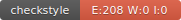

# Mon Projet Pokémon

## Auteur
Jordan FOUTE TAPE

## Groupe
Groupe Foute

## Badges

## Rapport checklist

## Description
Description du projet Pokémon

## Choix techniques d'implémentation
Explication des choix techniques d'implémentation du projet Pokémon

## Rapport de Test de la Team Rocket

Le test de la classe RocketPokemonFactory présente plusieurs défaut d'implémentation de cette classe.

premièrement on constate que un des nom  attentu par le test ne correspond pas au nom créé par la classe RocketPokemonFactory, ce qui fait echouer les test.

Ensuite le nombre de points d'attack ne correspond pas également au nombre de points généré lors de l'implémentation de la classe. car le nombre de points d'attack est fait de manière aléatoire.

